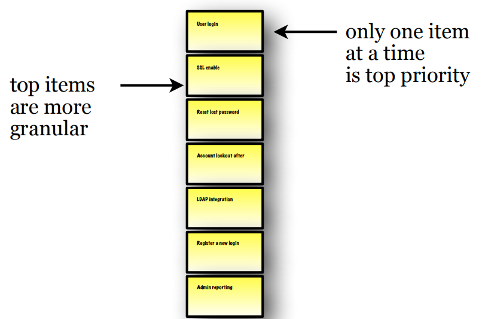
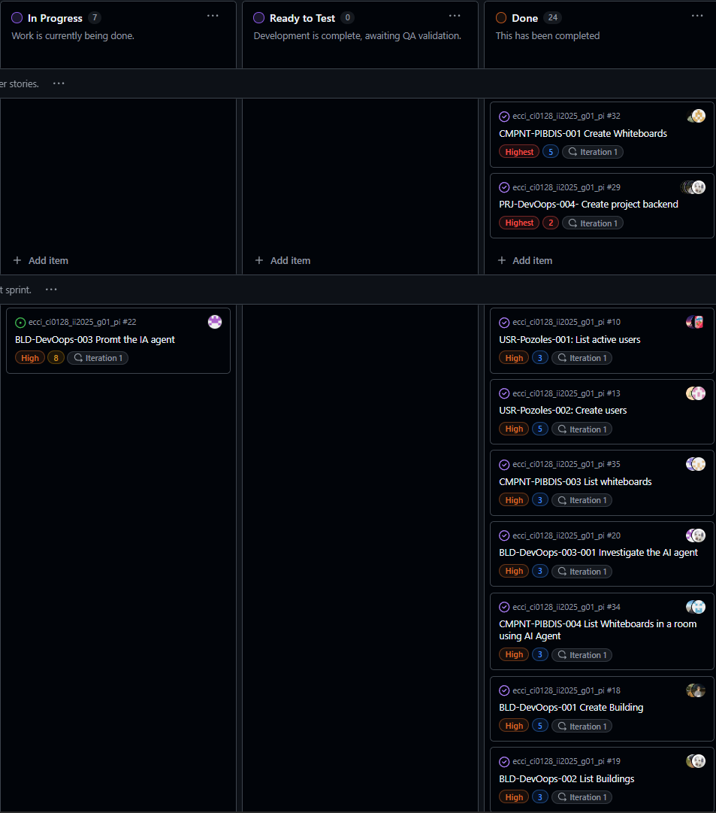
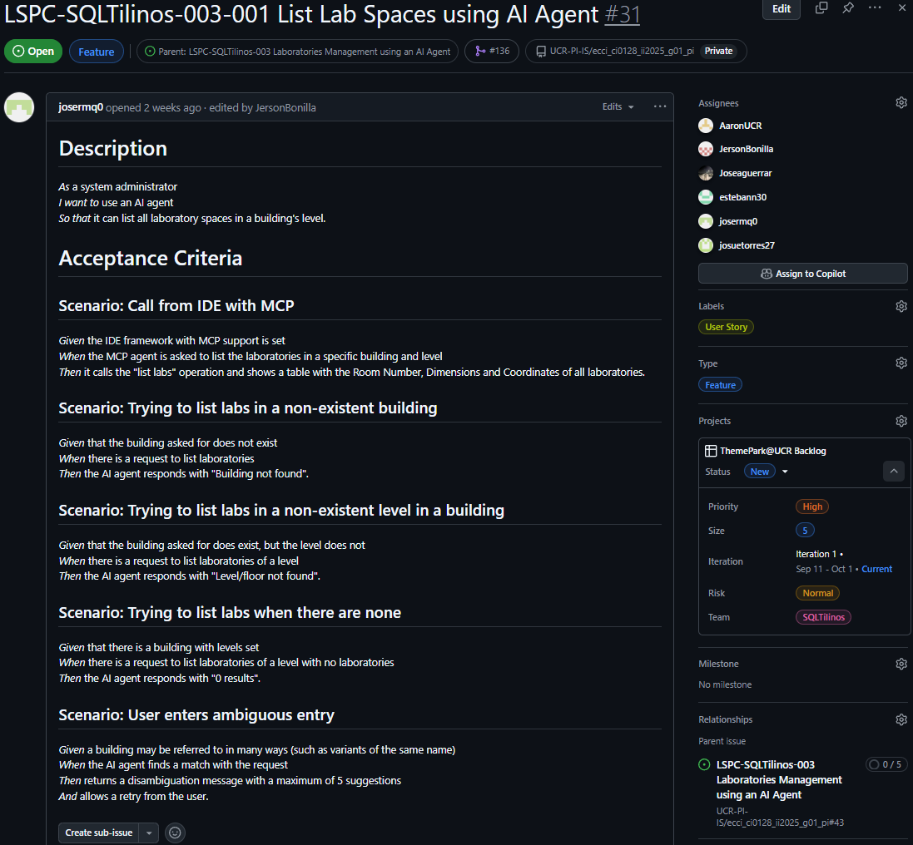
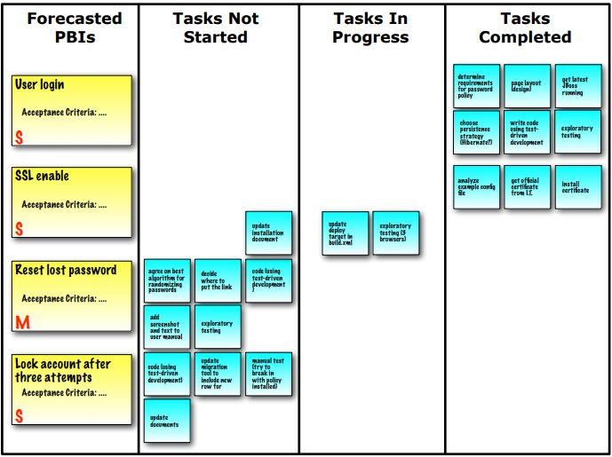

# 5. Technical Decisions

## Methodologies and Defined Processes

### For Project Management
- **Scrum**
  - **Sprint Ceremonies**:
    - Sprint Planning.
    -  Daily Standups.
    - Sprint Review: Last Wednesday of sprint (50 minutes).
    - Sprint Retrospective: Wednesday after sprint review (50 minutes).
  - **Tools**: GitHub Projects for Sprint tracking, GitHub Issues for PBI management.

### For Software Development
- **Clean Architecture**
  - **Project Structure**:
    - `Backend.Domain`: Core business logic, entities, value objects
    - `Backend.Application`: Use cases, application services, DTOs
    - `Backend.Infrastructure`: Database access, external services, repositories
    - `Backend.Api`: Controllers, middleware, dependency injection setup
  - **Dependency Flow**: API → Application → Domain ← Infrastructure
  - **Testing Strategy**: Unit tests for Domain, Integration tests for Infrastructure, API tests for Controllers

- **Test Driven Development (TDD)**
  - **Testing Framework**: xUnit with FluentAssertions for .NET 9
    - Unit Tests: Domain entities, value objects, services
  - **Mocking**: Moq framework for external dependencies

- **Domain-Driven Design (DDD)**
  - **Bounded Contexts**: Users, InteractiveComponents, LearningSpaces
  - **Aggregate Design**:
    - User Aggregate: User entity with Email value object
    - InteractiveComponent Aggregate: InteractiveComponent with PlateId, Coordinates, Dimensions
  - **Repository Pattern**: Interface in Domain, implementation in Infrastructure
  - **Value Object Implementation**: Immutable classes with validation in constructors
  - **Domain Events**: For cross-aggregate communication (future implementation)

- **Continuous Integration / Continuous Delivery (CI/CD)**
  - Build using Github Actions after PR to main/development.

### For Planification and Control
- **Agile Iterative Delivery**

- **Sprint Planning**
  - User Stories
  - Story points estimation.

- **Backlog Refinement**
- **Retrospective**

## Project Development Artifacts

Within the Scrum framework, the main artifacts used in this project (Sprint 0) were:

---

### Product Backlog

The **Product Backlog** is a prioritized list of functionalities and requirements that represent the remaining work for the product.  
In our case, it was created during Sprint 0 and will be continuously refined together with the team, ensuring it reflected the project’s needs and served as the  source of what had to be implemented.  
 
- Contains all product-related items.  
- Visible to all stakeholders.  
- Constantly adjusted and prioritized by the Product Owner and the team.  
- Items near the top are smaller and more detailed than those at the bottom.  

**Visual example:** 

  

The **Product Backlog** was managed using **Issue Labels** in GitHub, which allowed us to organize features, track progress, and maintain visibility across the team:

  

---

### Product Backlog Items (PBIs)

**PBIs** are the individual work items within the Product Backlog.  
For this project, PBIs were written as *user stories* to keep a customer-centric perspective and ensure clarity of requirements.  

- Describe the *what* (what should be achieved), not the *how*.  
- Often include acceptance criteria to validate completion.  
- Estimated in relative units (story points) to support Sprint Planning.  
- Refined and updated regularly by the Scrum Team.  

**Visual example:**

  

The **PBIs** were managed using **GitHub Issues**, which made it easier to break down work, assign responsibilities, and link tasks to code changes:

    

---

### Sprint Backlog

The **Sprint Backlog** is the set of PBIs selected for a Sprint, along with the actionable plan to deliver them.  
It represents the team’s commitment and serves as a day-to-day guide during Sprint execution.  

- Contains only the PBIs agreed during Sprint Planning.  
- May evolve as new tasks are discovered, but without endangering the Sprint Goal.  
- Reviewed daily during the *Daily Scrum* to maintain alignment.  
- Visible to the entire team to support transparency and accountability.  

**Visual example:**

  

The **Sprint Backlog** was managed using **GitHub Projects**, which provided a visual board to track progress, manage tasks, and facilitate collaboration.

---

### 📚 Reference

- Scrum Reference Card: [https://scrumreferencecard.com/ScrumReferenceCard.pdf](https://scrumreferencecard.com/ScrumReferenceCard.pdf)

---
## Technologies and Versions

Can be found in the [Standards & Quality Guidelines](./ST&QT-Convention.md) document.

## Code Repository and Git Strategy

Check the [Gitflow Convention](./GITFLOW-Convention.md) document for more information.

## Definition of Done (DoD)

Can be found in the [PBI Convention](./PBI-Convention.md) document.

## Data Requirements

The data requirements for the project were gathered through a combination of meetings with the **product owner** and **user stories**. The key data requirements identified include:

### Interactive Components Data Requirements

#### Data Entities and Attributes:

* **Interactive Component Information:**
    * *Entity:* InteractiveComponent.
    * *Attributes*: Color, Texture, LearningSpaceId.
    * *Owned/value object:* `PlateId` with attribute `Value`.
    * *Owned/value object:* `Coordinates` with attributes `X`, `Y`, and `Z`.
    * *Owned/value object:* `Dimensions` with attributes `Width`, `Height`, and `Depth`.

* **Whiteboard Information:**
    * *Entity:* Whiteboard.
    * *Attributes*: Color, Texture, LearningSpaceId.
    * *Owned/value object:* `PlateId` with attribute `Value`.
    * *Owned/value object:* `Coordinates` with attributes `X`, `Y`, and `Z`.
    * *Owned/value object:* `Dimensions` with attributes `Width`, `Height`, and `Depth`.

#### Data Relationships:

* One-to-many relationship between LearningSpace and InteractiveComponent.
    * *Entities:* LearningSpace and InteractiveComponent.
    * A LearningSpace can have multiple InteractiveComponent, but each InteractiveComponent can belong to only one department.
#### Data Validation Rules:

* Color must be a valid hexadecimal color code.
* Texture must be a non-empty string.
* Coordinates must be within the bounds of the Learning Space.
* Dimensions must be positive values, Width and Height can not be 0.
* LearningSpaceId must reference an existing Learning Space.
* PlateId must be unique across all InteractiveComponents and Whiteboards.

### Users Data Requirements

#### Data Entities and Attributes:

* **User Information:**
    * *Entity:* User.
    * *Attributes*: Id, Name, isActive, Email.
    * *Owned/value object:* `Email` with attribute `Value`.

#### Data Relationships:

* Many-to-many relationship between User and InteractiveComponent.
    * *Entities:* User and InteractiveComponent.
    * Multiple Users can interact with multiple InteractiveComponents.
    
#### Data Validation Rules:

* Id should be lower than 16 characters
* Email should have only one `@`.
* Email should have a domain after `@`.
* Email domain should have a dot.
* Email should have a username before the `@`.
* Email should have no especial characters.
* Name should be greater than 3 characters

#### Data Storage and Retrieval:

* Data will be stored in a relational database (Microsoft SQL Server).
* Data will be retrieved by CRUDL methods in the application.
* Data will be accessed through a repository pattern to ensure separation of concerns and maintainability.
* Data will be available in a Swagger UI for testing and documentation purposes.
* Data can be asked for with the MCP AI Agent.

### Buildings Data Requirements
#### Data Entities and Attributes:
Below are the entities and attributes derived from the `Buildings` schema used by the project. Types use SQL Server conventions and validation notes indicate expected domain constraints.

* **Building**
  * *Table:* `Buildings.Building`
  * *Columns*:
    * `Id` — INT, NOT NULL, IDENTITY(1,1) — Primary Key
    * `Name` — NVARCHAR(200) — Optional human-readable name for the building
  * *Constraints*: `PK_Building` on `Id`.
  * *Validation / business rules*:
    * `Name` should be non-empty for user-facing buildings; max length 200.
    * `Id` is generated by the DB and must be unique.

* **BuildingRenderInfo**
  * *Table:* `Buildings.BuildingRenderInfo`
  * *Columns*:
    * `Id` — INT, NOT NULL, IDENTITY(1,1) — Primary Key
    * `Surface` — DECIMAL(18,2) NOT NULL — Surface area (units: square meters)
    * `Volume` — DECIMAL(18,2) NOT NULL — Volume (units: cubic meters)
    * `Width` — DECIMAL(18,2) NOT NULL — Width dimension (meters)
    * `Height` — DECIMAL(18,2) NOT NULL — Height dimension (meters)
    * `Texture` — NVARCHAR(50) NOT NULL — Texture identifier or name
    * `Color` — NVARCHAR(10) NOT NULL DEFAULT '#CDCECF' — Hex color code (default provided)
    * `X` — DECIMAL(18,2) NOT NULL — X coordinate (meters)
    * `Y` — DECIMAL(18,2) NOT NULL — Y coordinate (meters)
    * `Z` — DECIMAL(18,2) NOT NULL — Z coordinate (meters)
  * *Constraints*: `PK_BuildingRenderInfo` on `Id`.
  * *Validation / business rules*:
    * `Surface`, `Volume`, `Width`, `Height` must be >= 0; Width and Height should not be zero when representing visible geometry.
    * `Texture` must be a non-empty string and reference an existing texture catalog where applicable.
    * `Color` must be a valid hexadecimal color in the form `#RRGGBB` (default `#CDCECF` when omitted).
    * Coordinates (`X`, `Y`, `Z`) should fall within project-defined bounds and use consistent units (meters).

* **Floor**
  * *Table:* Buildings.Floor`
  * *Columns*:
    * `BuildingID` — INT NOT NULL — Foreign key to `Buildings.Building(Id)`
    * `Level` — INT NOT NULL — Floor level number
    * `Height` — DECIMAL(18,2) NOT NULL — Floor height (meters)
  * *Constraints*:
    * Primary Key: composite (`BuildingID`, `Level`) — `PK_Floor`
    * Foreign Key: `FK_Floor_Building` references `Buildings.Building(Id)`
  * *Validation / business rules*:
    * `BuildingID` must reference an existing `Building` row.
    * `Level` is an integer (allow negative values for basements if needed) and combined with `BuildingID` forms a unique floor entry.
    * `Height` must be > 0 and realistic (e.g., between 2.0 and 10.0 meters depending on building type).

### Learning Spaces Data Requirements

#### Data Entities and Attributes:

* **Learning Space Information**
    * *Entity:* LearningSpace.
    * *Attributes*: Id, BuildingId, FloorLevel, RoomId
    * *Owned/value object:* `LearningSpaceCoordinates` with attributes `XCoordinate`, `YCoordinate`, and `ZCoordinate`.
    * *Owned/value object:* `LearningSpaceDimensions` with attributes `Length`, `Width`, and `Height`.

* **Laboratory Information**
    * *Entity:* Laboratory.
    * *Attributes*: Id, BuildingId, FloorLevel, RoomId
    * *Owned/value object:* `LearningSpaceCoordinates` with attributes `XCoordinate`, `YCoordinate`, and `ZCoordinate`.
    * *Owned/value object:* `LearningSpaceDimensions` with attributes `Length`, `Width`, and `Height`.

#### Data Relationships:

* One-to-many relationship between LearningSpace and Building.
    * *Entities:* LearningSpace and Building.
    * A Building can have multiple learning spaces, and a learning space can only belong to a single Building.

* One-to-many relationship between LearningSpace and Floor.
    * *Entities:* LearningSpace and Building.
    * A Floor can have multiple learning spaces, and a learning space can only belong to a single Floor.

#### Data Validation Rules:

* The `RoomId` and `BuildingId` combination must be unique for each room.
* Coordinates must be positive, non-null, and non-infinite numbers.
* Dimensions must be valid nonnegative, and non-infinite numbers.
* BuildingId must reference an existing Building.

#### Data Storage and Retrieval:

* Learning space data will be stored in a relational database (Microsoft SQL Server), through the `LearningSpace` schema.
* CRUDL operations will be implemented for `LearningSpace` data.
* `LearningSpace` data will be accessed through a repository pattern to ensure separation of concerns and maintainability.
* `LearningSpace` data may be retrieved and created through a Swagger UI.
* `LearningSpace` data can be managed using an MCP AI Agent.
* To handle `LearningSpace` inheritance, the Table-Per-Type (TPT) pattern is used.

## Database Conceptual Design

A link to the Entity-Relationship Diagram Diagram can be found in the [DB-convention](./DB-Convention.md) document.

## Database Logical Design

A link to the Relational Diagram can be found in the [DB-convention](./DB-Convention.md) document.

---

[↩️ Back to Main README](../README.md)