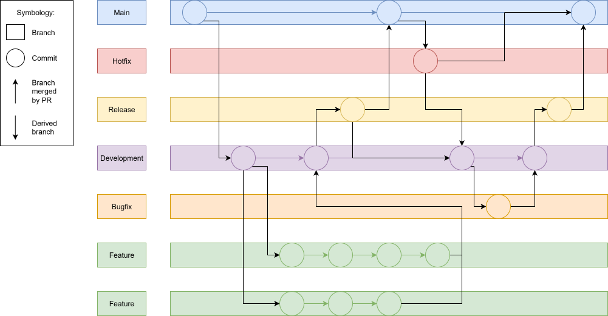
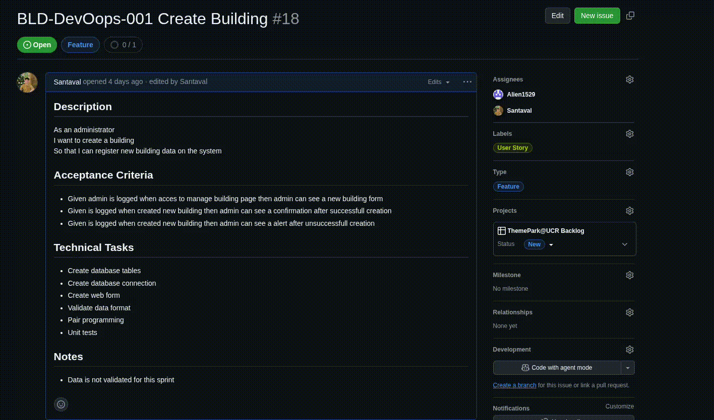

# Gitflow Convention

> In this document, we outline the Gitflow branching strategy adopted by our team to ensure a structured and efficient workflow for version control and collaboration.

---

## Branching Model

The Gitflow branching model consists of the following types of branches:

### Main Branches

- **`main`**
  - The main branch represents the production-ready state of the codebase
  - All changes to this branch should be thoroughly tested and reviewed

- **`development`**
  - The development branch serves as the integration branch for features
  - Contains the latest development changes and is where feature branches are merged

### Supporting Branches

- **`feature/*`**
  - Used to development new features or enhancements
  - Created from development branch and merged back into development when complete

- **`bugfix/*`**
  - Used to address issues or bugs in the codebase
  - Created from development branch and merged back into development when resolved

- **`hotfix/*`**
  - Used to quickly address critical issues in the production environment
  - Created from main branch and merged back into both main and development when resolved

- **`docs/*`**
  - Used to document changes or updates to the codebase
  - Created from development branch and merged back into development when complete


### Release
Each integration to the main branch must be done through a release tag. This ensures that all changes are properly versioned and can be easily tracked. Here is the official Github documentation about how to create a release: [Creating a release](https://docs.github.com/en/repositories/releasing-projects-on-github/managing-releases-in-a-repository)

### Branching Model Diagram



## Workflow

### 1) Creating a Feature Branch

```bash
git checkout development
git checkout -b feature/your-feature-name
```



### 2) Committing Changes

```bash
git add .
git commit -m "Description of your changes"
```

#### Commit Convention

> **Golden Rule**: Give the "what" and the "why" of the commit, not the "how".


#### Commit Formats

| Type | Format Example | Description |
|------|---------------|-------------|
| Feature | `feat: add user authentication so that users can log in` | New features |
| Bugfix | `fix: resolve login issue so that users can log in successfully` | Bug fixes |
| Documentation | `docs: update API documentation so that it reflects new endpoints` | Documentation changes |
| Refactor | `refactor: improve code structure so that it follows best practices` | Code improvements |
| Test | `test: add unit tests for user service so that code coverage is improved` | Testing changes |
| Chore | `chore: update dependencies so that they are up to date` | Maintenance tasks |

### Issues linked to commits
When working on a feature or bugfix, link your commits to the relevant issue by including the issue number in the commit message. For example:

```bash
git commit -m "feat: add user authentication so that users can log in (#123)"
```


### 3) Merging Changes
When your feature is complete, send a pull request to merge your feature branch back into the development branch. After approval, merge the changes.

---

## Pull Request Strategy

### Feature branch to Development branch

| Aspect | Requirements |
|--------|-------------|
| **Title** | Use a concise title that summarizes the feature or bugfix |
| **Description** | Provide a detailed description of the changes made, including the purpose and any relevant context |
| **Reviewers** | Assign team members to review the pull request, at least 3 approvals are required |
| **Labels** | Use labels to categorize the pull request (e.g., feature, bugfix, documentation) |
| **Linked Issues** | Reference any related issues or tasks in the description |
| **Testing** | Ensure that all tests pass and that the code has been tested locally before merging |

### 🚀 Release branch to Main branch

| Aspect | Requirements |
|--------|-------------|
| **Title** | Use a title that indicates the release version (e.g., "Release v1.0.0") |
| **Description** | Summarize the changes included in the release, including new features, bugfixes, and any breaking changes |
| **Reviewers** | Assign team members to review the pull request, at least 4 approvals are required (one per team member, ideally scrum master) |
| **Labels** | Use labels to categorize the pull request (e.g., release) |
| **Linked Issues** | Reference any related issues or tasks in the description |
| **Testing** | Ensure that all tests pass and that the code has been tested in a staging environment before merging |

### 📌 Important Notes

> ⚠️ The size of the pull request should be manageable. If the changes are too large, consider breaking them into smaller, more focused pull requests. Too large means max 20 minutes of review time, it's up to each reviewer to check pull request size and ask for changes if necessary.


---

## Conclusion

> By following the Gitflow branching strategy, our team can maintain a clean and organized codebase while facilitating collaboration and continuous integration. This approach allows us to work on multiple features simultaneously while minimizing conflicts and ensuring a smooth release process.


---

[↩️ Back to Technical Decisions README](./05-technical-decisions.md)
